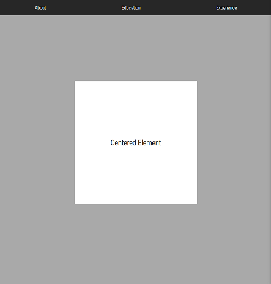

# A collection of useful mixins for scss.

## List of Mixins:

-   ## Place elements:
    This will place elements according to the example positions below:
    - "top-left"
    - "bottom"
    - "center-right"
  
  `@include place-element("center")`
    
